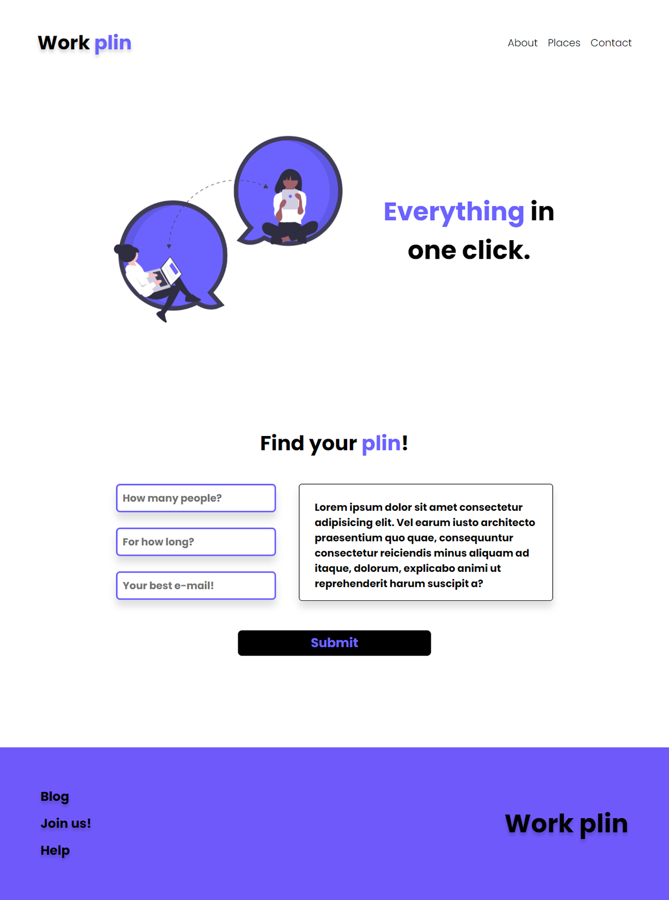

# Work Plin - DevChallenge

Esse desafio se trata de construir uma página sobre um site de locação de co-work online.  
Página do Desafio no <a href="https://www.devchallenge.com.br/challenges/5fb5baad237c230021976396/details">DevChallenge</a>.

Falta:

- [x] ~~Terminar o HTML~~
- [x] ~~Terminal o CSS~~
- [ ] Deixar a página responsiva.

<strong>Projeto:</strong> <a href="https://luizfranzon.github.io/Codar-DevChallenge/meu_projeto/index.html">abrir no github pages</a>

